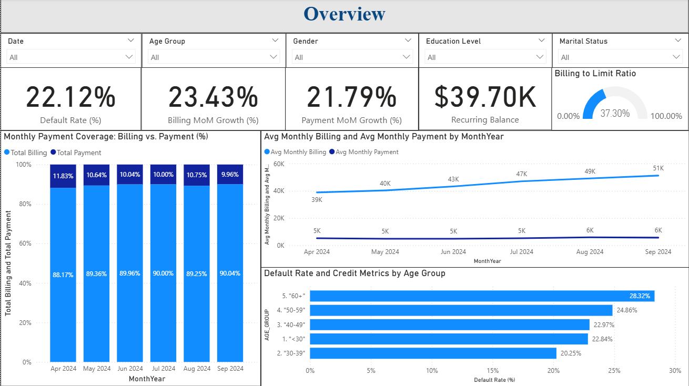
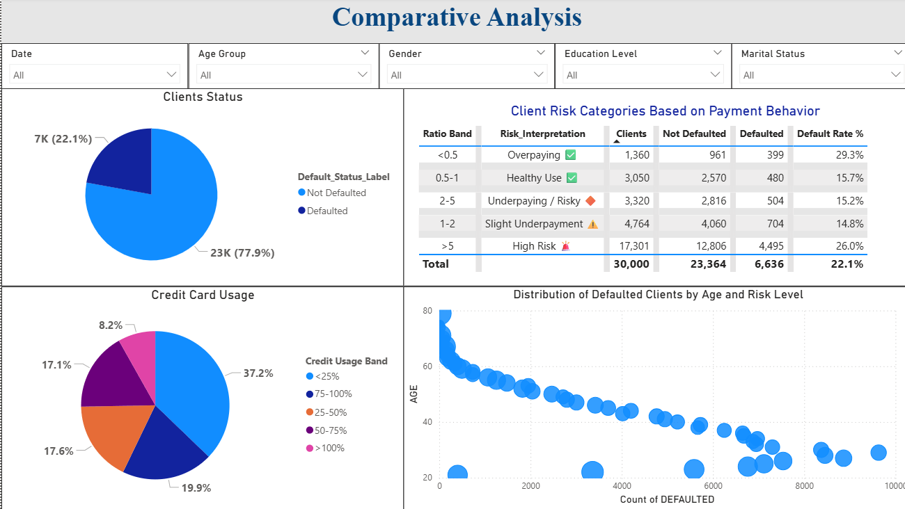
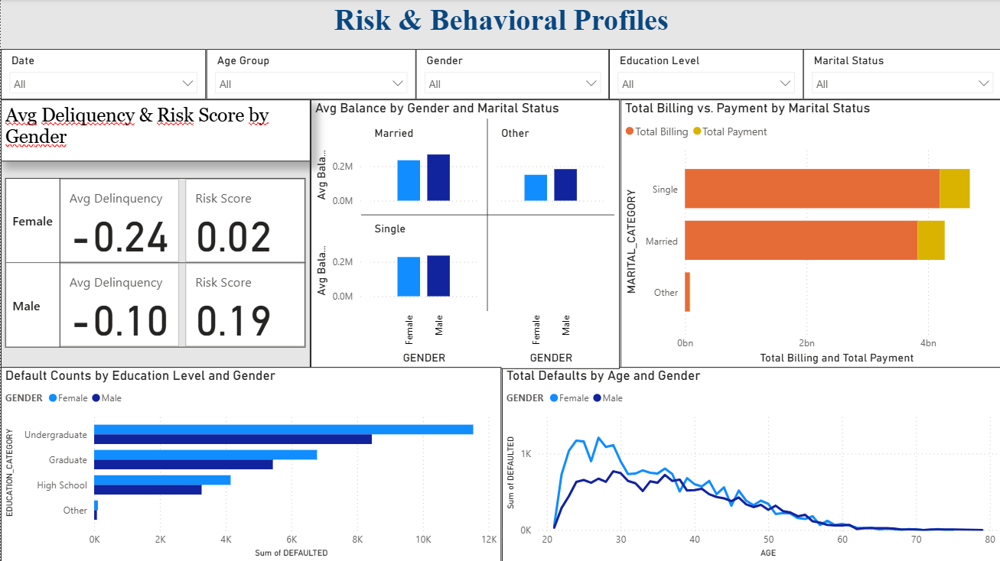
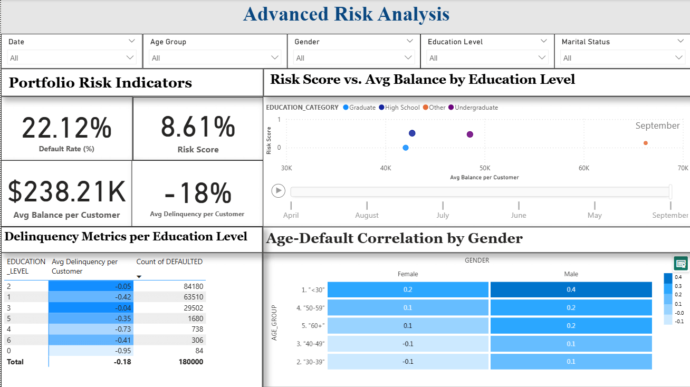
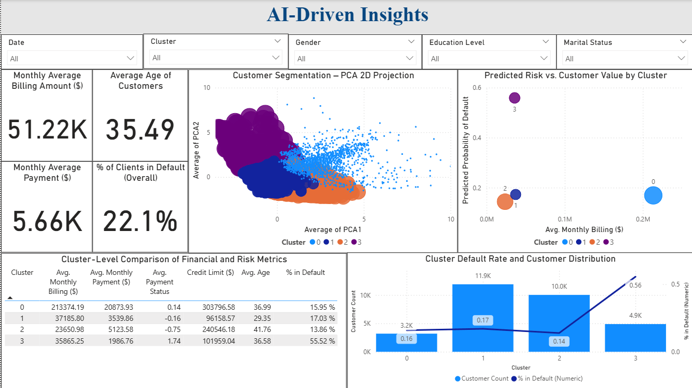

# Credit Risk Analysis — Power BI & Python Integration

Interactive Power BI dashboard analyzing credit risk using the UCI Credit Card Default dataset.  
This project integrates Python (PCA and K-Means Clustering) with Power BI to identify behavioral risk segments and optimize decision-making in financial management.

---

## Project Overview
This dashboard visualizes credit default behavior for over 30,000 customers.  
It combines data modeling, DAX-based KPIs, and AI-driven segmentation to evaluate key risk factors such as age, education, credit utilization, and payment behavior.  
The goal is to support informed credit policy, portfolio management, and customer engagement strategies.

**Tools used:**
- Power BI (data modeling, DAX measures, visualization)
- Python (pandas, scikit-learn, matplotlib for PCA & clustering)
- Excel (data source)

---

## Dashboard Pages
1. Overview — High-level KPIs and credit behavior metrics (Default Rate, MoM growth).  
2. Comparative Analysis — Differences between defaulters and non-defaulters by demographics.  
3. Risk & Behavioral Profiles — Risk scores segmented by gender, education, and marital status.  
4. Advanced Risk Analysis — Correlations by age, education level, and delinquency.  
5. AI-Driven Insights — PCA & clustering results (Python integration) with four customer segments.

---

## Dashboard Screenshots

| Page | Description | Preview |
|------|--------------|----------|
| Overview | High-level KPIs: Default Rate (22.1%), MoM trends in billing & payment. |  |
| Comparative Analysis | Behavioral differences between defaulters and non-defaulters. |  |
| Risk & Behavioral Profiles | Risk scores segmented by gender, education, and marital status. |  |
| Advanced Risk Analysis | Correlations by age, education, and delinquency level. |  |
| AI-Driven Insights (Python PCA + Clustering) | Four clusters identified; Cluster 3 = 0.56 default probability. |  |

---

## Key Insights
- Default rate: 22.1% overall, highest among customers aged 60+.  
- "Healthy Use" ratio (0.5–1.0) shows lowest default rate at 15.7%.  
- Higher education correlates with lower risk.  
- Cluster 3 shows the highest predicted default probability (0.56), requiring closer monitoring.  
- Integrating Python with Power BI enabled explainable segmentation and data-driven recommendations.

---

## How to View
1. Download the Power BI file: `Credit_Risk_Analysis_UCI.pbix`.  
2. Open it with Power BI Desktop to explore the pages interactively.  
3. Review the executive summary in `Credit_Risk_Analysis_Report.pdf` for business-level insights.  
4. Reference dataset: `UCI_Credit_Card_Default_Dataset.xlsx`.

---

## Author
**Jose Antonio Ayon Wu**  
Master of Data Analytics — Niagara Region, Ontario, Canada  
Email: joseayonwu@gmail.com  
GitHub: [github.com/joseayonwu](https://github.com/joseayonwu)  
LinkedIn: [linkedin.com/in/joseayonwu](https://www.linkedin.com/in/joseayonwu)
