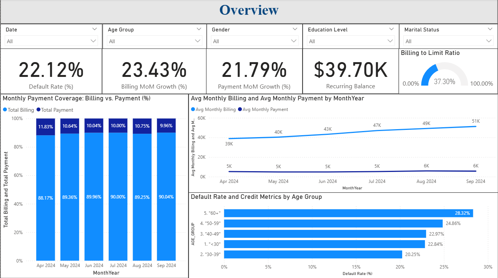
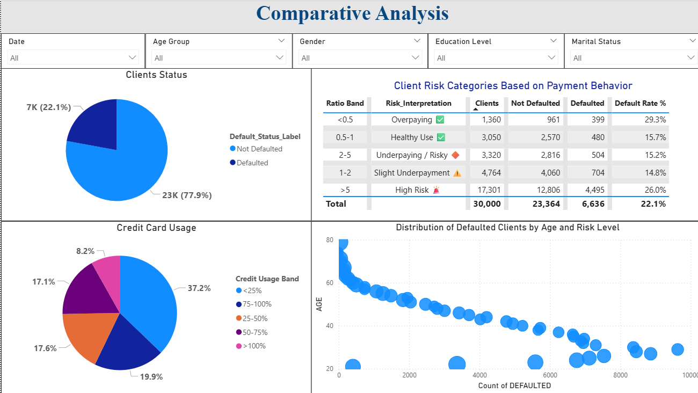
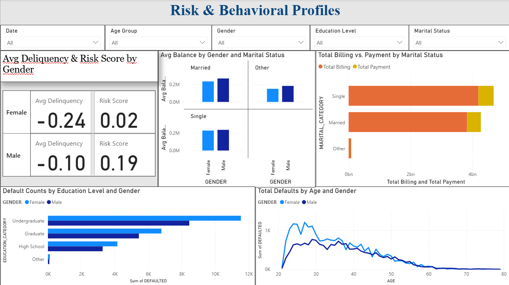
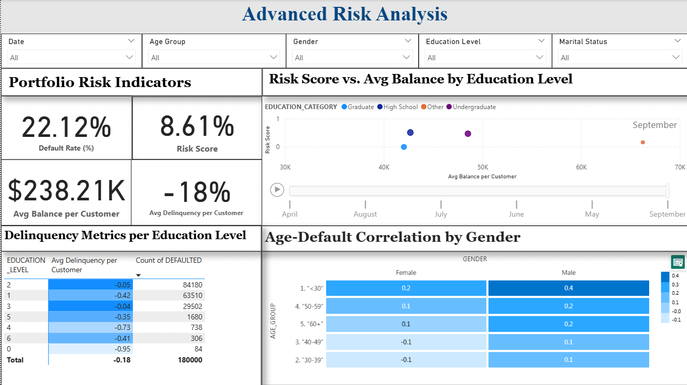
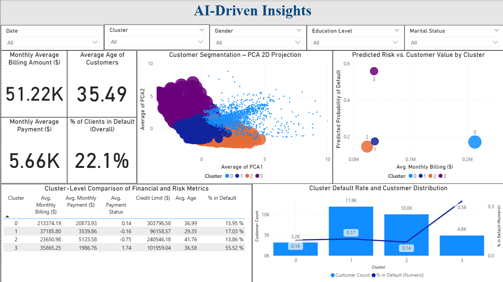

# Credit Risk Analysis — Power BI & Python Integration  
*Interactive dashboard combining data modeling, DAX, and machine learning for credit risk assessment.*

---

## Overview  

This project presents an **interactive Power BI dashboard** analyzing credit default behavior for over **30,000 customers** from the **UCI Credit Card Default dataset**.  
It integrates **Python (PCA and K-Means Clustering)** within Power BI to generate **AI-driven insights** and behavioral segmentation, supporting **data-driven credit policy and portfolio management**.  

Developed as part of the *Master of Data Analytics* program at the **University of Niagara Falls, Canada**, it demonstrates the ability to combine **business intelligence, predictive analytics, and storytelling** for executive decision-making.  

---

## 1. Tools & Technologies  

| Category | Tools |
|-----------|--------|
| **Data Modeling & Visualization** | Power BI (DAX measures, relationships, dashboards) |
| **Machine Learning & AI** | Python (Pandas, NumPy, Scikit-learn, Matplotlib) |
| **Data Source** | Excel (`UCI_Credit_Card_Default_Dataset.xlsx`) |
| **Reporting** | Power BI, PDF Executive Summary |

---

## 2. Dashboard Pages  

1. **Overview** – High-level KPIs and credit behavior metrics (Default Rate, MoM Growth).  
2. **Comparative Analysis** – Defaulters vs non-defaulters by demographics and payment patterns.  
3. **Risk & Behavioral Profiles** – Segmentation by gender, education, and marital status.  
4. **Advanced Risk Analysis** – Correlation between credit limit, delinquency, and repayment patterns.  
5. **AI-Driven Insights (Python)** – PCA and K-Means clustering identifying four behavioral groups.  

---

## 3. Dashboard Previews  

| Page | Description | Preview |
|------|--------------|----------|
| **Overview** | Default Rate (22.1%) and billing/payment trends. |  |
| **Comparative Analysis** | Demographic and behavioral differences by default status. |  |
| **Risk & Behavioral Profiles** | Risk segmentation by education, gender, and marital status. |  |
| **Advanced Risk Analysis** | Correlation insights by age and delinquency. |  |
| **AI Insights (Python)** | PCA + K-Means clustering: Cluster 3 shows 0.56 default probability. |  |

---

## 4. Key Insights  

- Overall **default rate: 22.1%**, highest among customers aged 60+.  
- **Healthy Use Ratio (0.5–1.0)** group shows lowest default risk (15.7%).  
- **Higher education levels correlate** with lower default probability.  
- **Cluster 3** (identified via K-Means) has the **highest default probability (0.56)**.  
- Integrating **Python with Power BI** enables explainable AI segmentation and better financial risk control.  

---

## 5. How to View  

1. Download the Power BI file: `Credit_Risk_Analysis_UCI.pbix`  
2. Open with **Power BI Desktop** to explore the pages interactively  
3. Review the **executive report (Credit_Risk_Analysis_Report.pdf)** for summarized insights  
4. Reference dataset: `UCI_Credit_Card_Default_Dataset.xlsx`  

---

## 6. Technical Highlights  

- **Data modeling** with relational schema and DAX calculations  
- **Python integration** for PCA dimensionality reduction and K-Means clustering  
- **ETL workflows** (data cleaning, normalization, transformation)  
- **Performance tuning** for large datasets (30K+ records)  
- **KPI and dashboard design** for business storytelling  

---

## 7. Keywords  

`Power BI` · `Python` · `PCA` · `K-Means` · `EDA` · `ETL` · `Data Modeling` · `DAX` · `KPI Design` · `AI Integration` · `Machine Learning` · `Credit Risk` · `Predictive Analytics` · `Storytelling with Data`  

---

## 8. Author  

**José Antonio Ayón Wu**  
Master of Data Analytics — University of Niagara Falls, Canada  
📍 Ontario, Canada  
📧 [joseayonwu@gmail.com](mailto:joseayonwu@gmail.com)  
🔗 [LinkedIn](https://www.linkedin.com/in/joseayonwu) | [GitHub](https://github.com/joseayonwu)

---

*If you found this project useful, please ⭐ the repository and connect on LinkedIn.*  
© 2025 **José Antonio Ayón Wu** | *Data Analytics Portfolio*
